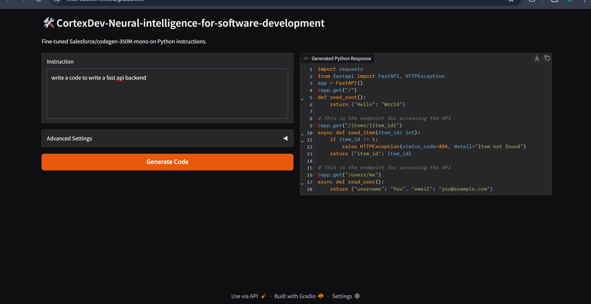
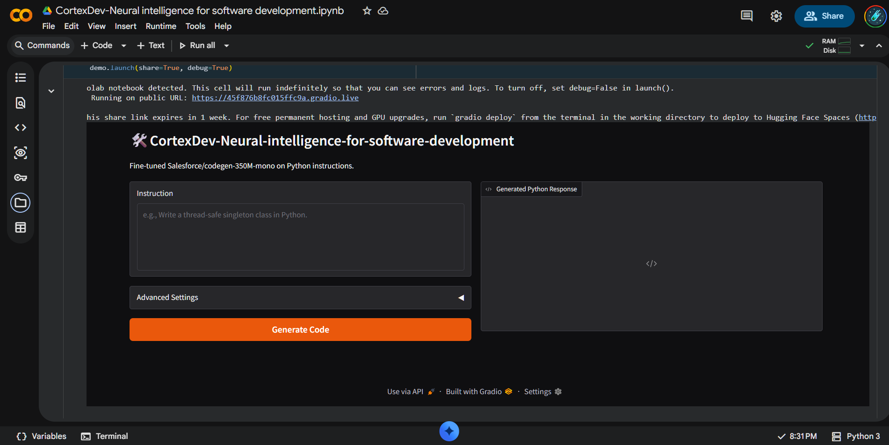

# CortexDev — Neural Intelligence for Software Development

A focused, fine‑tuned code generation model designed to produce clean, executable Python code with minimal overhead.

---

## ✨ What is CortexDev?

CortexDev is a lightweight, fine‑tuned model based on **Salesforce CodeGen‑350M** using **LoRA**.  
It’s built to **think like a developer** and output **code‑only responses** with consistent structure and style.

**Key highlights**
- ✅ Fine‑tuned model (not prompt engineering)
- ✅ Code‑only output by default
- ✅ Optimized for Colab & low‑VRAM environments
- ✅ Reproducible, professional fine‑tuning workflow

---

## 📸 Screenshots

**Notebook + Gradio UI**


**Example generation**


---

## 🧠 Why CortexDev?

Traditional prompt‑based assistants are inconsistent and verbose.  
CortexDev embeds the behavior directly into model weights so you get:

| Challenge | Traditional Prompting | CortexDev |
|----------|------------------------|-----------|
| Prompt dependency | Requires long system prompts | Built‑in behavior |
| Output consistency | Varies by prompt | Consistent code style |
| Extra explanations | Mixed output | Code‑only |
| Colab safety | Heavy models | Lightweight |

---

## 🏗️ Architecture Overview

```
Base Code LLM (CodeGen‑350M)
        ↓
Frozen Base Weights
        ↓
LoRA Adapter Layers (Trainable)
        ↓
Custom Python Instruction Dataset
        ↓
CortexDev — Code Generation Model
```

---

## 🤖 Base Model

**Salesforce CodeGen‑350M**
- Pretrained on source code
- Strong syntax understanding
- Compact enough for Colab
- Ideal for LoRA fine‑tuning

**Approx. VRAM usage:** 6–8 GB (fp16 + LoRA)

---

## 🧩 Fine‑Tuning Strategy

**Technique:** LoRA (Parameter‑Efficient Fine‑Tuning)

✅ Frozen base weights  
✅ Trainable adapter layers  
✅ Lower memory usage  
✅ Faster convergence  

| Method | Used |
|--------|------|
| Training from scratch | ❌ |
| Full fine‑tuning | ❌ |
| LoRA / PEFT | ✅ |

---

## 📦 Dataset Format

Each sample is structured as **prompt → completion**:

```json
{
  "prompt": "Write a Python function to check if a number is prime.",
  "completion": "def is_prime(n):\n    if n <= 1:\n        return False\n    for i in range(2, int(n ** 0.5) + 1):\n        if n % i == 0:\n            return False\n    return True"
}
```

---

## ⚙️ Training Configuration (Colab‑Safe)

| Parameter | Value |
|----------|-------|
| Batch Size | 1 |
| Epochs | 2–3 |
| Precision | fp16 |
| Max Length | 512 |
| Optimizer | AdamW |
| Fine‑Tuning | LoRA |

---

## 🧪 Inference Example

**Input**
```
Write a Python function to reverse a string
```

**Output**
```
def reverse_string(s):
    return s[::-1]
```

No explanations.  
No markdown.  
Just executable code.

---

## 🛠️ Tech Stack

- Python
- HuggingFace Transformers
- PEFT (LoRA)
- PyTorch
- Google Colab
- Gradio

---

## 📌 Use Cases

✅ Personalized coding assistants  
✅ Hackathon accelerators  
✅ Educational code generators  
✅ Backend scaffolding tools  
✅ Domain‑specific code models

---

## 📄 License

MIT License — free to use, modify, and extend.

---

## ✅ Final Note

**CortexDev is not a chatbot.**  
It is a trained model that outputs code like a focused developer.
